# Python & Pandas: Movie Genres Data Analysis Project

#
#### by Alex Melino
#

### Background Information

This is a sample project using the Pandas Python library to perform an analysis on a dataset of over ten thousand movies spanning from 1960 to 2015. The analysis is inteded to focus on the genres of the movies and how the different genres have peformed in terms of popularity, budget, revenue and profit over time.

The following libraries and dependancies are required to run this Jupyter Lab notebook: Pandas, Seaborn, Matplotlib. They can be installed using a basic '!pip install' command.

### Research Questions and Hypotheses

The project seeks to answer some questions and confirm or deny some hypotheses all relating to movie genre patterns. The following is a list of questions and hypotheses that are later answered:

Research Questions:
1. Which genres are the most common (number of movies made)?
2. Which genres have high avg. budget and revenue?
3. Which genres have high avg. profit?
4. Which genres have high avg. popularity?
5. Which genres have highest number of movies with a voting avg >= 8?

Research Hypotheses:
1. The best movies according to vote avg. return the highest profit and revenue.
2. The best movies according to popularity return the highest profit and revenue.
3. Highly budgeted movies return high profit.
4. Highly budgeted movies have high popularity.
5. Movies have made more profit over time (based on genre).

### Data Exploration and Cleaning

The dataset used comes from the IMDB website and it contains a lot of information that was unnecessary to the analysis being performed for this project. Therefore, some data cleaning steps were taken to set up the data for easy visualization later on. The dataset file can be found in the 'Resources' folder of this directory as 'imdb_movies.csv'

The first steps here were to remove duplicate rows and remove rows with null values in the 'genres' column as that column would be crucial to the analysis.

Next, a new calculated column named 'profit' was created based on the 'revenue' and 'budget' columns.

The unneeded columns were then dropped, and a new dataframe was crated to work with the data. 

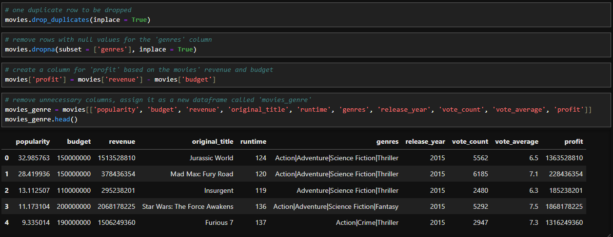

Finally, the 'genres' column was split and used as an index. That index was converted to a new column ad added to the working dataframe.

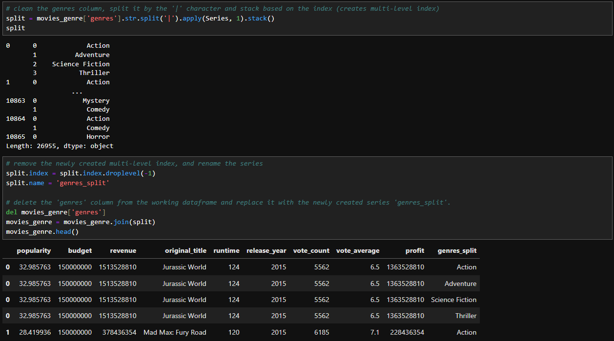

### Data Visualization

The following visualizations were created using Pandas, Matplotlib, and Seaborn libraries to answer the research questions and hypotheses listed above.

1. Which genres are the most common (number of movies made)?
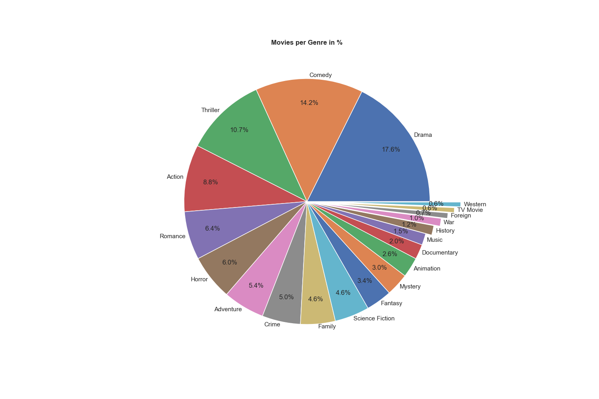
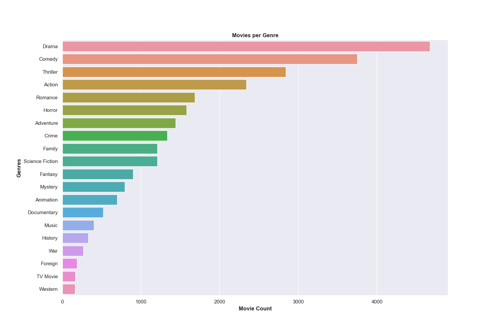

2. Which genres have high avg. budget and revenue?
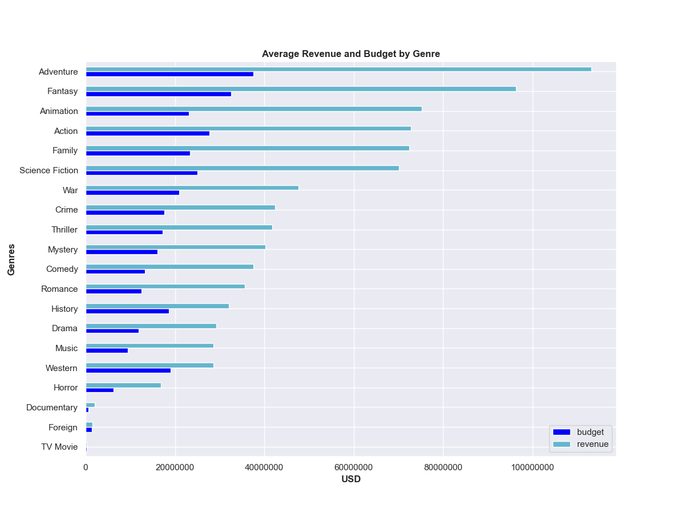

3. Which genres have high avg. profit?
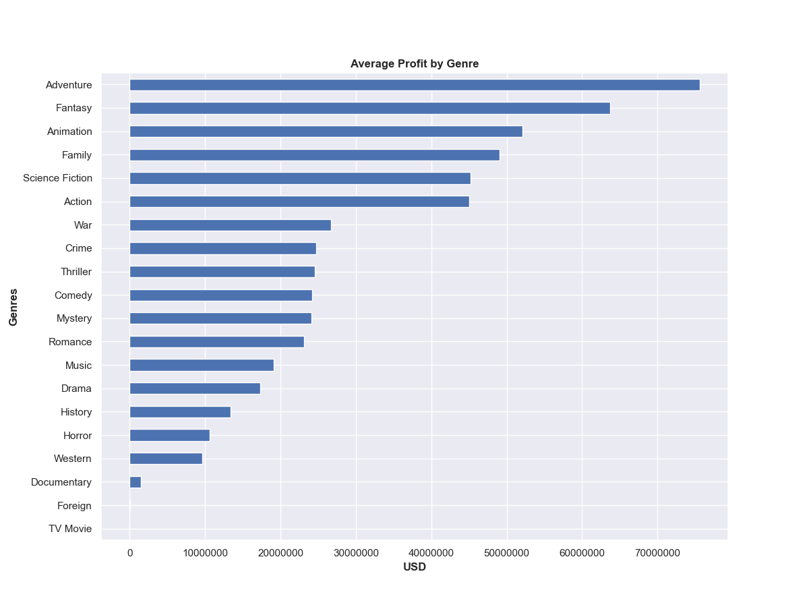

4. Which genres have high avg. popularity?
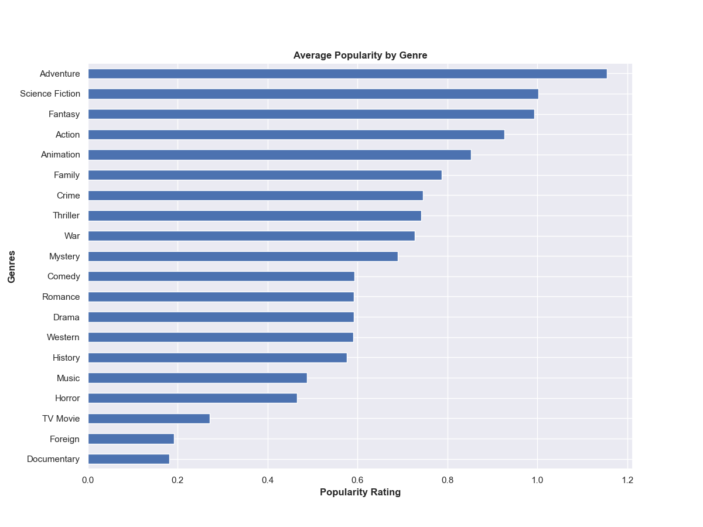

5. Which genres have highest number of movies with a voting avg >= 8?
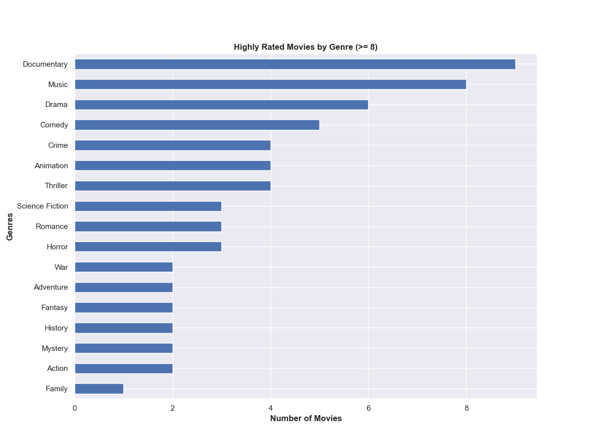

1. The best movies according to vote avg. return the highest profit and revenue.
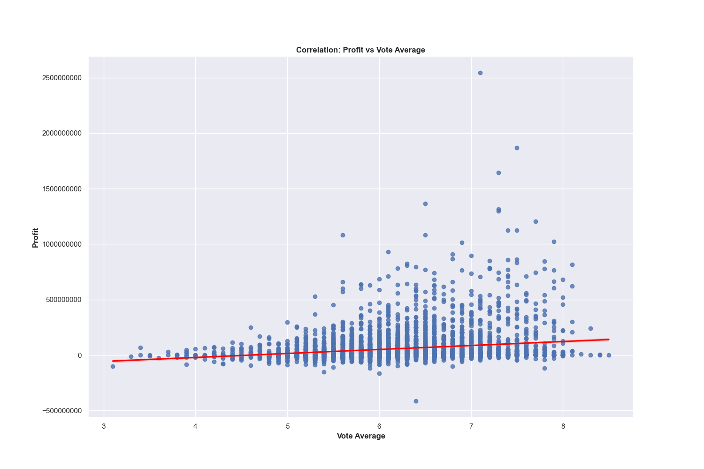
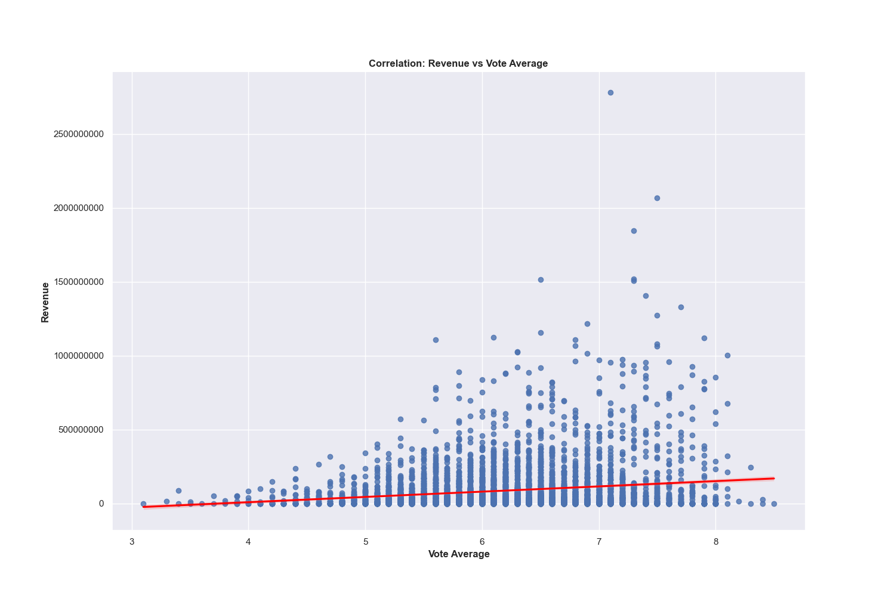

2. The best movies according to popularity return the highest profit and revenue.
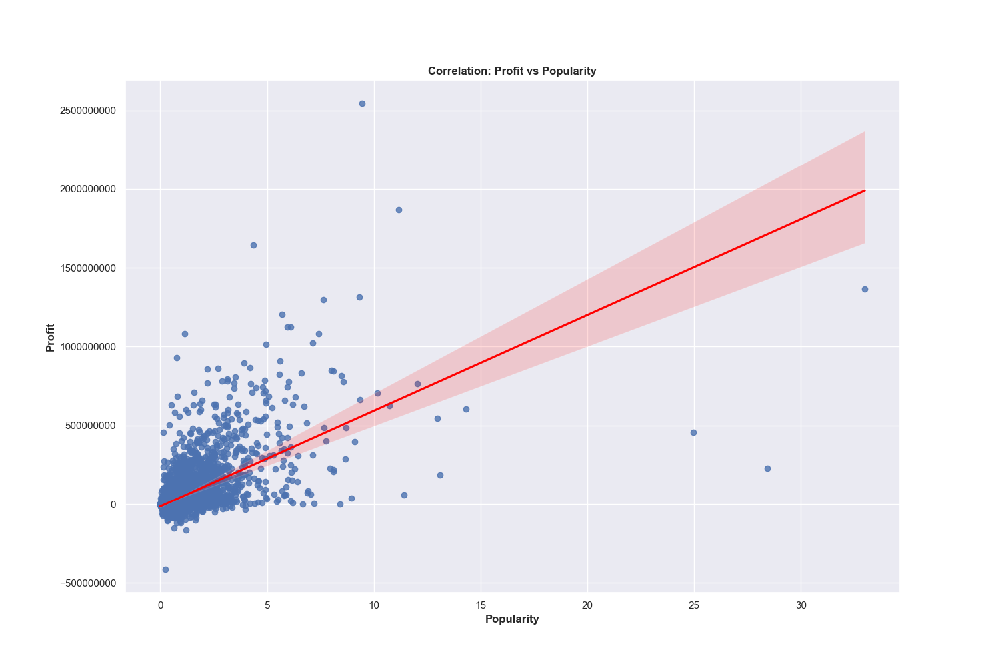
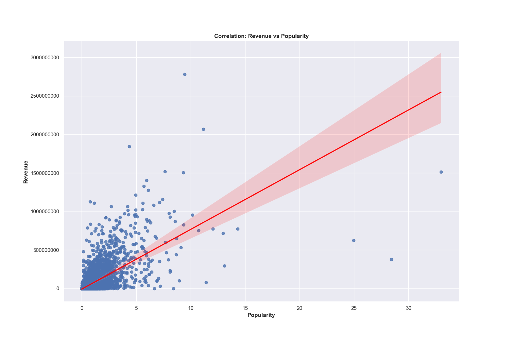

3. Highly budgeted movies return high profit.
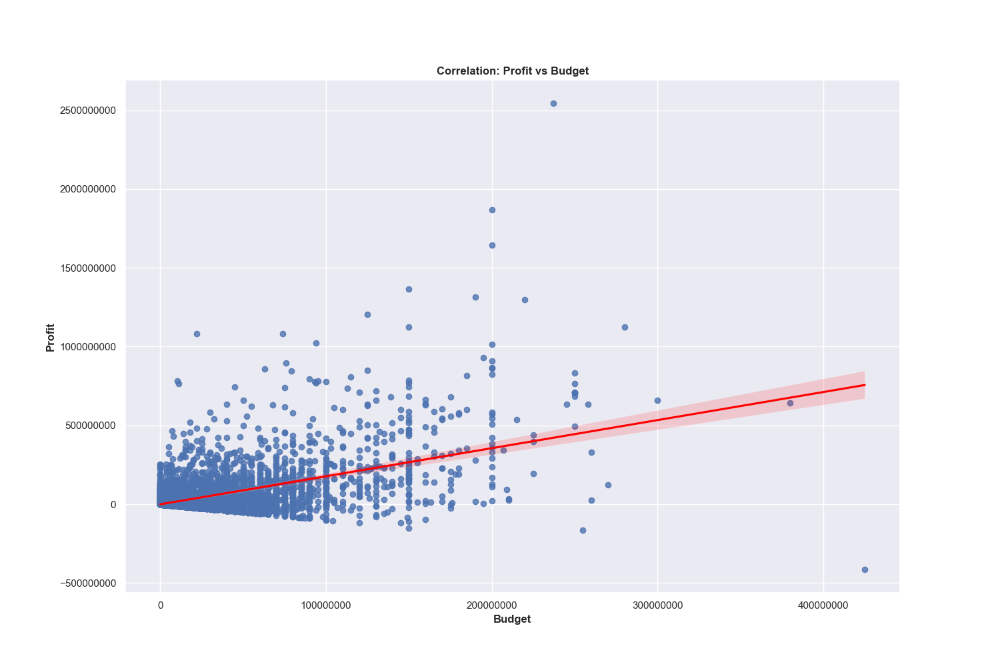

4. Highly budgeted movies have high popularity.
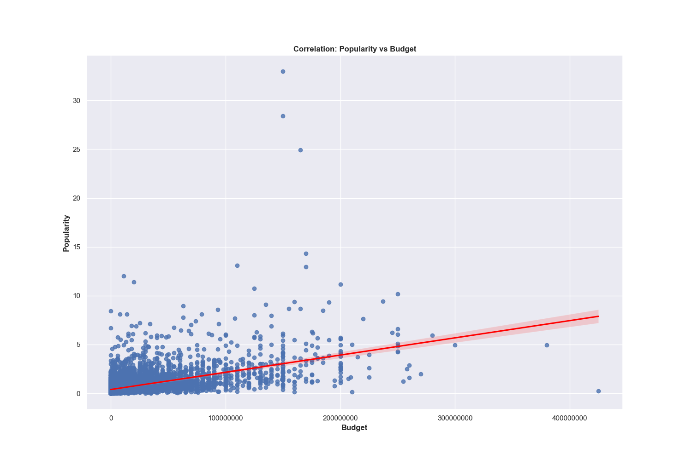

5. Movies have made more profit over time (based on genre).
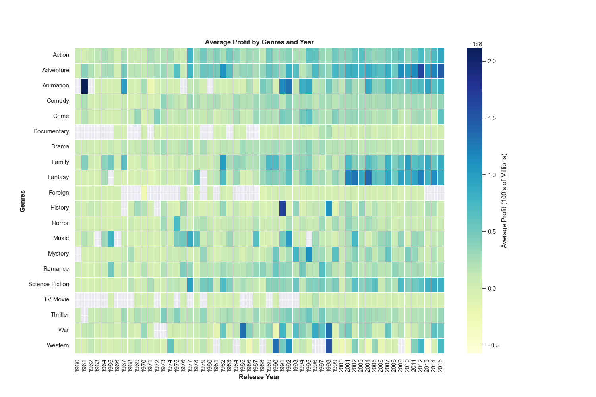

### Further Analysis

